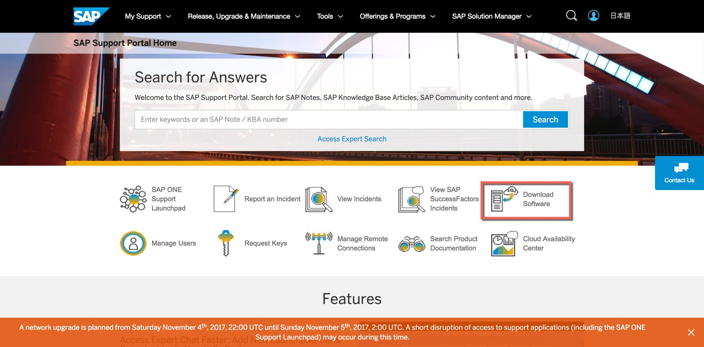
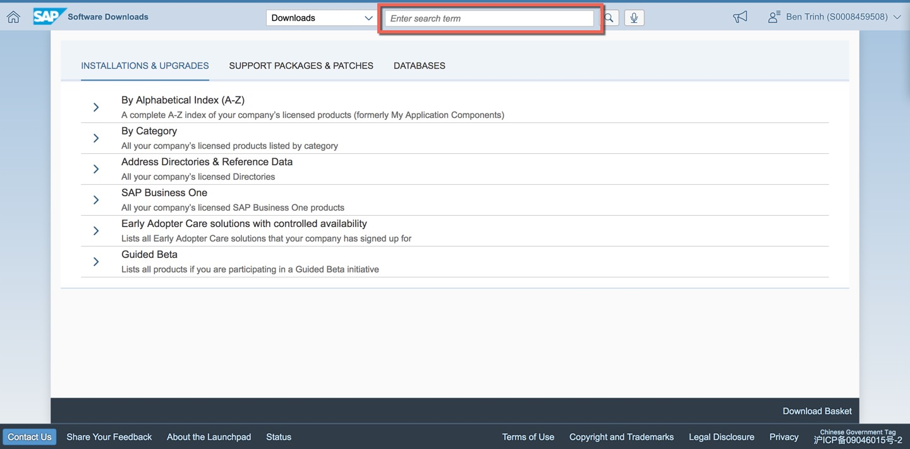
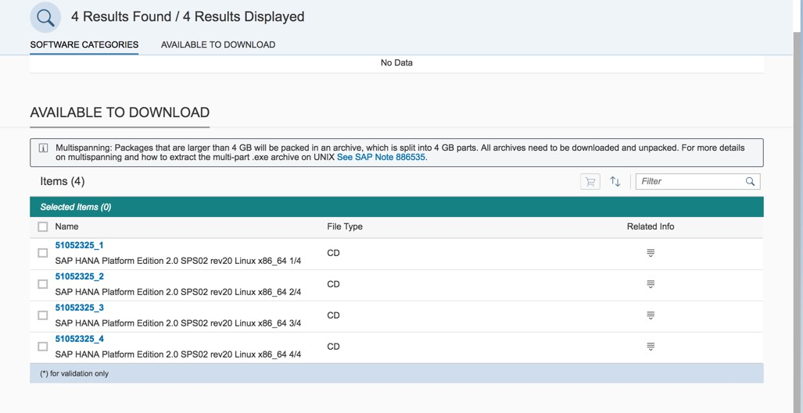

# SAP HANA ARM Installation
This ARM template is used to install SAP HANA on a single VM running SUSE SLES. It uses the Azure SKU for SAP. **We will be adding additional SKUs and Linux flavors in future Versions.** The template takes advantage of [DSC for Linux](https://github.com/Azure/azure-linux-extensions/tree/master/DSC) and the [Custom Script Extensions](https://github.com/Azure/azure-linux-extensions/tree/master/CustomScript) for the installation and configuration of the machine.

[Deploy to Azure](https://portal.azure.com/#create/Microsoft.Template/uri/https%3A%2F%2Fstagea66a6dd3ca954d68bdd.blob.core.windows.net%2Fazuresaphana22rgt-stageartifacts%2Fazuredeploy.json)


## Machine Info
The template current deploys HANA on a one of the machines listed in the table below with the noted disk configuration.  The deployment takes advantage of Managed Disks, for more information on Managed Disks or the sizes of the noted disks can be found on [this](https://docs.microsoft.com/en-us/azure/storage/storage-managed-disks-overview#pricing-and-billing) page.

Machine Size | RAM | Data and Log Disks | /hana/shared | /root | /usr/sap | hana/backup
------------ | --- | ------------------ | ------------ | ----- | -------- | -----------
E16 | 128 GB | 2 x P20 | 1 x S20 | 1 x S6 | 1 x S6 | 1 x S10
E32 | 128 GB | 2 x P20 | 1 x S20 | 1 x S6 | 1 x S6 | 1 x S20
E64 | 432 GB | 2 x P20 | 1 x S20 | 1 x P6 | 1 x S6 | 1 x S30
GS5 | 448 GB | 2 x P20 | 1 x S20 | 1 x P6 | 1 x S6 | 1 x S30
M64s | 1TB | 2 x P30 | 1 x S30 | 1 x P6 | 1 x S6 | 2 x S30
M64ms | 1.7TB | 3 x P30 | 1 x S30 | 1 x P6 | 1 x S6 | 3 x S30
M128S | 2TB | 3 x P30 | 1 x S30 | 1 x P6 | 1 x S6 | 3 x S30
M128ms | 3.8TB | 5 x P30 | 1 x S30 | 1 x P6 | 1 x S6 | 5 x S30

## Installation Media
Installation media for SAP HANA should be downloaded and place in the SapBits folder. This location will be automatically be uploaded to Azure Storage upon deployment.  Specifically you need to download SAP package 51052325, which should consist of four files:
```
51052325_part1.exe
51052325_part2.rar
51052325_part3.rar
51052325_part4.rar
```

To perform this download, go to http://support.sap.com, and log on with your credentials.  You should see a screen that looks like this:




Click **Download Software**, which will result in this page:



In the search box (highlighted in red in the above screenshot), enter **51052325** and click the  button to search.
This should result in a screen that looks like this:



For each of the four package numbers in blue, click to download the package, and save in the **SapBits** folder of this project.

If you want to install HANA Studio, Search for **212_2-80000323**, and download that package as well. 

You can check the integrity of these files by using the md5sum program, and the md5 hash values are stored in the file md5sums.  This command will check all the deployment files:
```
md5sum -c md5sums
```

## Configure the Solution
To customize the Azure environment that is deployed, you can edit the `azuredeploy.parameters` file, which contains the network names, IP addresses and virtual machine names that will be deployed in the next step.

To customize the HAHA deployment, you can edit the `SapBits/hdbinst.cfg` - you can change various options such as the SID name and passwords.  

***Please do not change the line***:
```
hostname=REPLACE-WITH-HOSTNAME
```
***because this gets filled in automatically when you do the deployment.***

## Deploy the Solution
The solution must be run from PowerShell on Windows that is logged into Azure. *The Powershell script takes advantage of some PowerShell functions that are not available in the cross-platform PowerShell yet.* It assumes you have logged in and selected the subscription to which you would like to deploy to. If this is not the case run `Login-AzureRmAccount` to get logged in. Once logged in, the current subscription should be displayed. If a different subscription is necessary, run `Get-AzureRmSubscription` to list the subscriptions and then `Select-AzureRmSubscription -SubscriptionName "YOURSUBNAME"` to select the subscription where the solution is to be deployed.

The ARM template should be deployed using the `Deploy-AzureResourceGroup.ps1` file. The solution uses the `azuredeploy.parameters.json` file to set the deployment parameters like Resource Group name, location, and VM size. The solution can be deployed in any location with the available sku. **We will be adding additional SKUs that will drive the available deployment locations.** For more information on Sku availability can be found on the [Azure website](https://azure.microsoft.com/en-us/pricing/details/cloud-services/).

```powershell
./Deploy-AzureResourceGroup.ps1 -UploadArtifacts
```

If the files are already uploaded to the staging directory, running the `./Deploy-AzureResourceGroup.ps1` with no switch will skip the upload process.

## Desired State Configuraiton
This installation takes advantage of [Azure Automation Desired State Configuration](https://azure.microsoft.com/en-us/blog/what-why-how-azure-automation-desired-state-configuration/) to manage the configuration and installation of HANA. Once the Powershell script runs successfully you should have the HANA VM deployed in your subscription, as well as an Azure Automation Account. Please allow up to 30 minutes after the Powershell script ends for DSC to configure HANA. You can check the progress in your Azure Subscription, navigate to DSC Nodes under the Automation Account and find the Virtual Machine. The first consistency check is expected to fail, as the DSC script includes a reboot. Once the node shows as "Consistent" the installation is complete.

## Troubleshooting

## Code of Conduct
Code of Conduct
This project has adopted the Microsoft Open Source Code of Conduct. For more information see the Code of Conduct FAQ or contact [opencode@microsoft.com](mailto:opencode@microsoft.com) with any additional questions or comments.